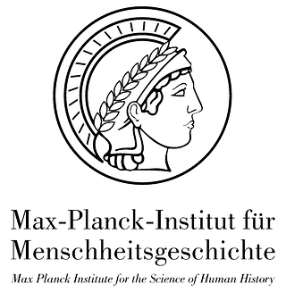

  

# Assessment and Reflection on the Ethical Dimensions of Archaeogenetics Research 

* [Changelog](CHANGELOG.md)
* [Introduction](chapter_0.md)
* [Chapter 1: Stakeholders and access to human remains](chapter_1.md)

Upcoming:

* [~~Chapter 2: Archaeological remains are a finite resource~~](chapter_2.md)
* [~~Chapter 3: Major challenges for investigating the past by means of genetics~~](chapter_3.md)
* [~~Chapter 4: Results about the human past can have an impact on the human present and future, and must be carefully communicated~~](chapter_4.md)
* [~~Chapter 5: Many disciplines study the human past, and interactions across disciplines are challenging because they have different intellectual histories, approaches/viewpoints, and terminology~~](chapter_5.md)
* [~~Chapter 6: Data Sharing, Open Access and Computational Reproducibility~~](chapter_6.md)

We want to encourage a discussion and would very much appreciate your feedback. Please share your comments, critique and suggestions on our [github respository](https://github.com/nevrome/ethics_statement/issues) or in an email to [Stephan Schiffels](mailto:schiffels@shh.mpg.de) and [Selina Carlhoff](mailto:carlhoff@shh.mpg.de).

